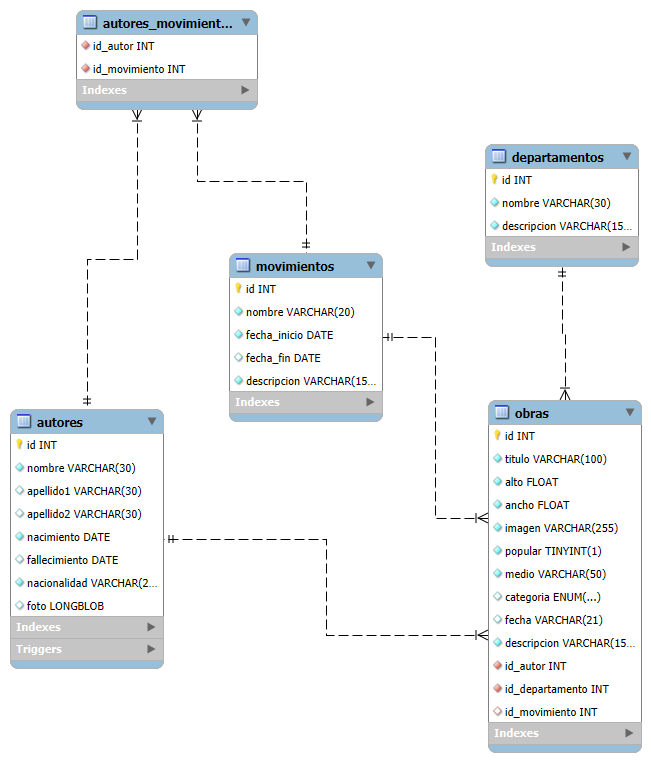
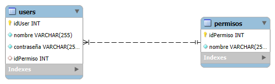

# Index

# 1. Introducción

Siguiendo la temática del primer proyecto decidimos hacer una base de datos sobre obras de arte, añadiendo datos como sus autores o departamentos, aquí su diagrama E/R:

A mayores creamos una base de datos en la que almacenamos los usuarios, sus contraseñas almacenadas y su rol. Su diagrama E/R

