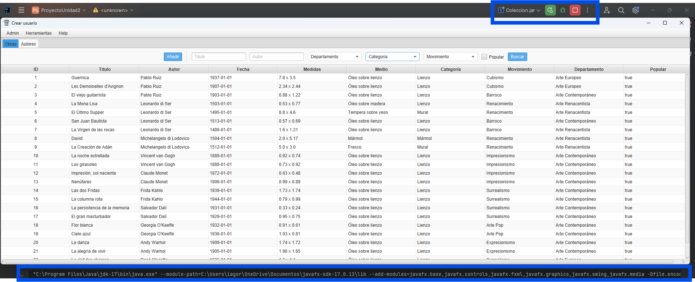

# Index

- [1. Introducción](#1._introducción)
- [2. Manual técnico para desarrolladores](#2._Manual_técnico_para_desarrolladores)
  - [2.1. Modelo](##2.1._Modelo)
  - [2.2. Vista](##2.2_Vista)
  - [2.3. Controlador](##2.3._Controlador)
- [3. Manual de usuario](#3._Manual_de_usuario)
- [4. Reparto de las tareas](#4._Reparto_de_las_tareas)
- [5. Extras realizados](#5._Extras_realizados)
- [6. Propuestas de mejora](#6._Propuestas_de_mejora)
- [7. Conclusiones y opinión del trabajo realizado, dedicación temporal y cualificación estimada](#7._Conclusiones_y_opinión_del_trabajo_realizado,_dedicación_temporal_y_cualificación_estimada)

# 1. Introducción

Siguiendo la temática del primer proyecto decidimos hacer una base de datos sobre obras de arte, añadiendo datos como sus autores o departamentos, aquí su diagrama E/R:


A mayores creamos una base de datos en la que almacenamos los usuarios, sus contraseñas almacenadas y su rol. Su diagrama E/R


# 2. Manual técnico para desarrolladores

La aplicación utiliza dos bases de datos, una para los datos de la colección de arte y otra para la información de las cuentas. Los archivos para la creación de ambas se encuentran dentro del proyecto e incluyen la creación de las tablas necesarias, la inserción de los datos iniciales (entre los que destacar la cuenta de administrador, **usuario:admin contraseña:admin123**) y la cración de procediminetos almacenados para algunas de las consultas.

La estructura del proyecto **sigue el patron Modelo-Vista-Controlador**, a continuación hablaremos de cada una de las partes.

## 2.1. Modelo 
  El paquete modelo inculye, clases para manejar la conexión a las BD, las clases para los elementos de la BD, una clase para mappear la conversión de los elementos, unas clases que representan los filtros de busqueda para obras y autores y enums que controlan ciertos atributos.

  Al trabajar con dos bases de datos utilizamos dos clases distintas, **DBConnector y UserModel**, en la primera tenemos todos los metodos necesarios para trabajar con la parte de la colección. Desde añadir nuevas obras hasta seleccionar movimientos por su id o todas las nacionalidades distintas. La lista completa de metodos sería:
  
|                       | **MÉTODOS DE LA CLASE DBConnector**                                                                                                                                                 |
| --------------------- | ----------------------------------------------------------------------------------------------------------------------------------------------------------------------------------- |  
| **CREACION**          |                                                                                                                                                                                     |
| createAutor()         | Recibe un objeto Autor y lo añade a la base de datos                                                                                                                                |
| createObra()          | Recibe un objeto Obra y lo añade a la base de datos                                                                                                                                 |
| **LECTURA**           |                                                                                                                                                                                     |
| getAllFromTable()     | (*deprecated*) Recibe un enum Table y devuelve todos los registros de la tabla correspondiente                                                                                      |
| getAllAutores()       | Devuelve un ArrayList\<Autor> que contiene los objetos equivalentes a cada registro de la tabla Autores.                                                                            |
| getAllDepartamentos() | Devuelve un ArrayList\<Depatamento> que contiene los objetos equivalentes a cada registro de la tabla Departamentps.                                                                |
| getAllMovimientos()   | Devuelve un ArrayList\<Movimiento> que contiene los objetos equivalentes a cada registro de la tabla Movimientos.                                                                   |
| getAllObras()         | Devuelve un ArrayList\<Obra> que contiene los objetos equivalentes a cada registro de la tabla Obras.                                                                               |
| getAutorById()        | Recibe un id (int) y devuelve un objeto Autor con los datos del registro  que coincida con el id.                                                                                   |
| getDepartamentoById() | Recibe un id (int) y devuelve un objeto Departamento con los datos del registro  que coincida con el id.                                                                            |
| getMovimientoById()   | Recibe un id (int) y devuelve un objeto Movimiento con los datos del registro  que coincida con el id.                                                                              |
| getObraById()         | Recibe un id (int) y devuelve un objeto Obra con los datos del registro  que coincida con el id.                                                                                    |
| getNacionalidades()   | Devuelve un ArrayList\<String> con todas las nacionalidades distintas que aparecen en la tabla Autores.                                                                             |
| getIdAutorPorNombre() | Recibe un nombre (String) y devuelve el id (int) del autor cuyo nombre coincida en la tabla Autores.                                                                                |
| filterAutores()       | Recibe un objeto QueryFieldsObjectAutor y devuelve un ArrayList\<Autor> con los objetos equivalentes a todos los registros que coincidan con los criterios de búsqueda.             |
| filterObras()         | Recibe un objeto QueryFieldsObjectObra y devuelve un ArrayList\<Obra> con los objetos equivalentes a todos los registros que coincidan con los criterios de búsqueda.               |
| **ACTUALIZACIÓN**     |                                                                                                                                                                                     |
| updateAutor()         | Recibe un objeto Autor y actualiza el registro con el mismo id con los datos proporcionados por el objeto. Devuelve true o false dependiendo de si se ha realizado la modificación. |
| updateObra()          | Recibe un objeto Obra y actualiza el registro con el mismo id con los datos proporcionados por el objeto. Devuelve true o false dependiendo de si se ha realizado la modificación.  |
| **ELIMINACIÓN**       |                                                                                                                                                                                     |
| deleteAutor()         | Recibe un objeto Autor y elimina el registro con el mismo id. Devuelve true o false dependiendo de si se ha realizado la modificación.                                              |
| deleteObra()          | Recibe un objeto Obra y elimina el registro con el mismo id. Devuelve true o false dependiendo de si se ha realizado la modificación.                                               |
| **COMPROBACIÓN**      |                                                                                                                                                                                     |
| checkIfIdExists()     | Recibe un id (int) y un nombre de tabla (String) y comprueba si el id existe en esa tabla. Devuelve un int, 1 si existe, 0 si no existe y -1 en caso de excepción.                  |


  
  Aquellas **clases que representan los elementos de las tablas de la BD**, además de sus constructores, getters y setters, cuentan con metodos para su comparación. Esto se debe a la necesidad de poder saber si dos instancias diferentes contienen los mismos datos sin que su identificador propio de Java devuelva la comparación como false.
  
  
  
  **Estas clases son:**
  
  - Autor
  - Departamento 
  - Movimiento
  - Obra
    


  La **clase Mapper** cuenta con un metodo para convertir cada tipo de registro en su objeto correspondiente. Estos metodos se usan dentor de las consultas a la BD de la clase BDConnector para poder devolver ArrayList de objetos con los que es más facil trabajar, para ello los metodos reciben un objeto ResultSet. También cuenta con metodos para controlar el proceso contrario, pasar un objeto Java a un registro, para esto reciben un PreparedStatement y un objeto del tipo que corresponda. Todos los metodos de esta clase son estáticos, por lo que no es necesario una instancia de la clase para utilizarlos.
  

Las **clases utilizadas para filtrar obras y autores son QueryFieldsObjectObra y QueryFieldsObjectAutor**, ya que los parametros de busqueda no cubren todos los atributos de los objetos Obra y Autor se utilizan estas clases  para representar los filtros y realizar las consultas necesarias.

**Los Enums Categoria y Tabla** se utilizan a lo largo del codigo ya que son opciones preestablecidas que no admiten nuevos valores.

## 2.2. Vista 

  La parte de vista incluye las distintas interfaces que encontramos a lo largo de la aplicacción. Son un total de 6 escenas, en la siguiente imagen podemos ver un esquema de como funciona el flujo entre ellas.
  
  

## 2.3. Controlador

El paquete controlador cuanta con una clase para cada una de las vistas además de una clase adicional para controlar los alerts que se usan para notificar al usuario.

### AccesoController

Las funciones más importantes de esta clase son validar las credenciales y encriptar las contraseñas para una mejor seguridad. A continuación podemos echar un vistazo al codigo que se encarga de esto.

```Java
//VALIDACION
 @FXML  
    public void validarCredenciales() throws IOException {  
  
        //valores que metió el usuario  
        String usernameAcceso = usernameField.getText();  
        String passwordAcceso = passwordField.getText();  
        String passwordaAccesoHaseada = hashPassword(passwordAcceso);  
  
        UserModel model = new UserModel();  
  
  
        int resultado = model.validarCredenciales(usernameAcceso, passwordaAccesoHaseada);  
  
        // Mostrar el mensaje de acuerdo al resultado  
        switch (resultado) {  
            case 0:  
                messageLabel.setText("Acceso exitoso");  
                int permiso = UserModel.permisosUser;  
                if (permiso == 1) {  
                    HelloApplication.setRoot("admin");  
                } else if (permiso == 2) {  
                    HelloApplication.setRoot("user");  
                }  
                //HelloApplication.setRoot("home");  
                break;  
            case 1:  
                messageLabel.setText("No hay usuario con ese nombre");  
                break;  
            case 2:  
                messageLabel.setText("Error: Contraseña incorrecta");  
                break;  
            default:  
                messageLabel.setText("Error en la conexión a la base de datos");  
                break;  
        }  
  
}  
  
//ENCRIPTACION  
private static String hashPassword(String password) {  
    try {  
        MessageDigest digest = MessageDigest.getInstance("SHA-256");  
  
        // Hashear la contraseña  
        byte[] hashBytes = digest.digest(password.getBytes());  
        StringBuilder hexString = new StringBuilder();  
        for (byte b : hashBytes) {  
            String hex = Integer.toHexString(0xff & b);  
            if (hex.length() == 1) {  
                hexString.append('0'); // Agregar un cero si es necesario  
            }  
            hexString.append(hex);  
        }  
  
        // Retornar el hash como cadena hexadecimal  
        return hexString.toString();  
  
  
    } catch (NoSuchAlgorithmException e) {  
        throw new RuntimeException(e);  
    }  
}
```
Como se pudo ver en el esquema anterior también se llama desde aquí a las vistas de crear usuario, administrador o usuario segun corresponda.

### CrearUserController
La creación de usuario es lo más importante de esta clase, para ello recoge los datos que el usuario introduce en la vista y realiza las comprobaciones necesarias, como asegurarse de que los campos no están vacios y que las contraseñas coinciden para evitar fallos. Si el formulario es correcto procede a introducir un nuevo registro de usuario en la base de datos, no sin antes encriptar la contraseña.

### AdminController
La interfaz del administrador cuenta con muchas funciones, ya que en su vista permite al usuario la visualizacion de los datos de las tablas Obras y Autores y las acciones principales de CRUD sobre las mismas.
Su metodo de inicialización carga los datos y la configuración de las tablas así como los balores de las ComboBox que se utilizan para el filtrado de autores y obras. Después los distintos listeners controlan las aciones de:
- Cerrar sesión
- Cerrar aplicación
- Exportar obras
- Exportar autores
- Buscar obras
- Buscar autores
- Añadir Obra
- Añadir Autor
- Editar Obra
- Editar Autor
- Eliminar Obra
- Eliminar Autor
- Mostrar dialog para añadir/modificar obras
- Mostrar dialog para añadir/modificar autores

### AutorDialogController y ObraDialogController
Ambos dialog funcionan de una forma muy similar, con un objeto de la clase correspondiente cuyos datos van ligados a los campos del formulario. Este objeto se usará para añadir un nuevo elemento o para modificar uno ya existente (paro lo que previamente se cargan los datos del objeto en el formulario). El controller cuenta con un boolean que controla en que modo se encuentra el dialog (creación o modificación) que cambia según quien haya llamado al dialog. Este modo determinará las acciones que se toman en su inicialización.

### UserController
Las funciones del UserController son más limitadas con respecto a su contra parte de administrador, pero la lista incluye:
- Buscar obras
- Exportar datos de la obra buscada
- Cerrar sesión
- Cerrar programa

### AlertMaker
Esta clase cuenta con metodos para crear y mostrar distintos tipos de alert, como los de Error, Informacion y Confirmación. Todos responden a esta estructura:

```Java
public static void showWarning(String titulo, String mensaje){
        Alert alert = new Alert(Alert.AlertType.WARNING);
        alert.setTitle(titulo);
        alert.setHeaderText(null);
        alert.setContentText(mensaje);
        alert.show();
        System.out.println(mensaje);
    }
```

### Jar ejecutable

Tal y como se pedía se realizo el jar ejecutable del proyecto utilizando Artifact en Intellij




# 3. Manual de usuario

# 4. Explicación del reparto de las tareas entre ambos integrantes.

#### Iago
- Login
- DB usuarios
- Filtrado de obras y autores
- Datos DB coleccion
- Toolbar archivo


#### Manuel
- Filtrado de obras y autores
- Filtrado de obras y autores
- DB coleccion
- Clases de los objetos Obra,autores...


#### Samuel

- Interfaces
- Eliminar autores y obras


# 5. Extras realizados

- **Login:** La aplicación cuenta con un sistema de login consultando a una DB con todos los usuarios, de ahí se coge su rol (admin o base) y se lleva al usuario a la ventana correspondiente. Además en el propio login puedes crear una cuenta en ese mismo momento

# 6. Propuestas de mejora

# 7. Conclusiones y opinión del trabajo realizado, dedicación temporal y cualificación estimada
